<!-- Managed with super-ux (ux-contract v4). The HOW layer: task analysis and user flows scenarios trace to. -->

# Flows — HOW layer

Screens are referenced by `SCR-ID`; their full specs live once in
[screens.md](screens.md). Rules obeyed here: every entry point listed, error
nodes end in a labelled recovery edge, happy paths stay at five steps or
fewer.

Scope: P0–P5 (see [../product-vision.md](../product-vision.md) §6). Flows for
the proactive layer, sync and carer mode arrive with their milestones.

## Flows

### FLW-01: First run — instant check
- **Traces:** ST-018, ST-001, ST-013 (JTBD-02, JTBD-04, JRN-01/#4)
- **Goal:** within 30 seconds of install the user sees real findings from their own browser, with no account and no configuration
- **Entry points:** extension installed (`onInstalled`); "run check again" from SCR-07
- **Success exit:** findings queue populated, or an explicit clean result
- **Task analysis:**
  1. Understand what this thing does and what it just checked
  2. See findings from their own tabs and extensions
  3. Decide what to do first
- **Flow:**

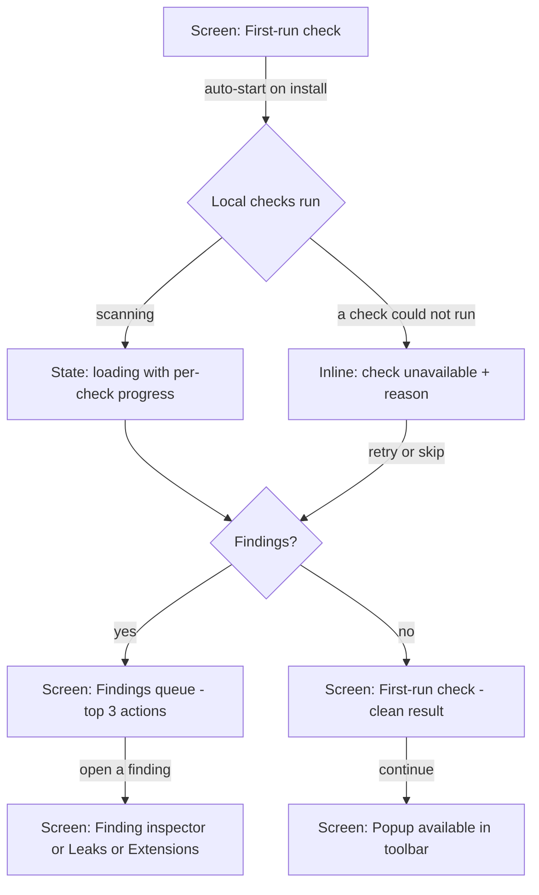
```mermaid
flowchart TD
  A[Screen: First-run check] -->|auto-start on install| B{Local checks run}
  B -->|scanning| A_load[State: loading with per-check progress]
  A_load --> C{Findings?}
  C -->|yes| D[Screen: Findings queue - top 3 actions]
  C -->|no| E[Screen: First-run check - clean result]
  B -->|a check could not run| B_err[Inline: check unavailable + reason]
  B_err -->|retry or skip| C
  D -->|open a finding| F[Screen: Finding inspector or Leaks or Extensions]
  E -->|continue| G[Screen: Popup available in toolbar]
```

- **Screens traversed:**
  | Screen | States used here |
  |--------|------------------|
  | SCR-01 First-run check | loading, empty, error, success |
  | SCR-07 Findings queue | success, empty |

### FLW-02: Hidden instruction found on a page
- **Traces:** ST-001, ST-002, ST-003 (JTBD-01, JRN-01/#5)
- **Goal:** the user learns a page carried instructions for an AI, can inspect them, and the page is left safe for their assistant
- **Entry points:** page load; DOM mutation batch; manual "re-scan" from SCR-02
- **Success exit:** finding neutralised and journalled, or dismissed deliberately
- **Task analysis:**
  1. Notice the banner without losing the page
  2. Inspect what was hidden and how
  3. Keep it neutralised, or restore and continue
- **Flow:**

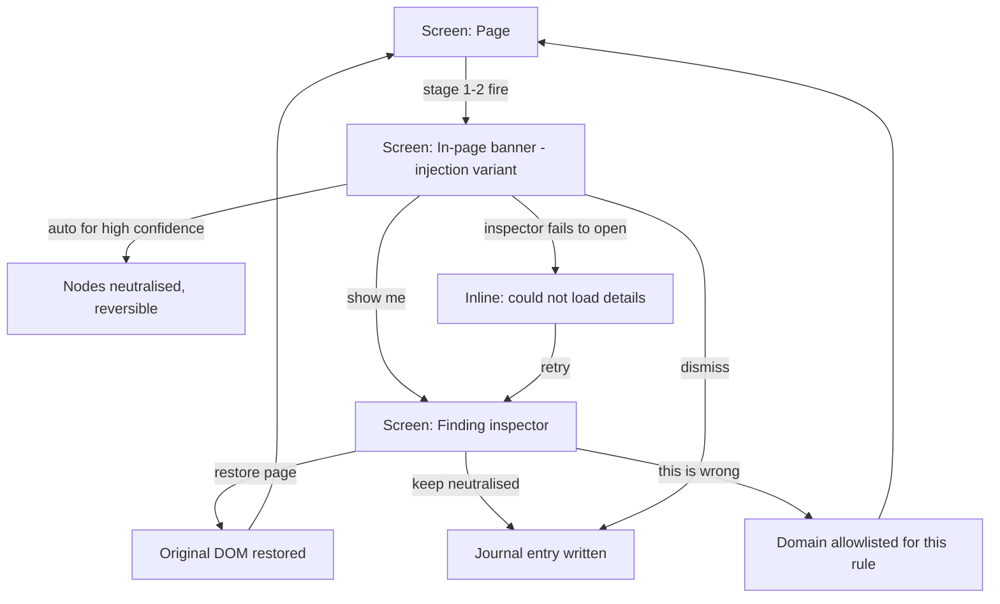
```mermaid
flowchart TD
  A[Screen: Page] -->|stage 1-2 fire| B[Screen: In-page banner - injection variant]
  B -->|auto for high confidence| N[Nodes neutralised, reversible]
  B -->|show me| C[Screen: Finding inspector]
  C -->|restore page| R[Original DOM restored]
  R --> A
  C -->|keep neutralised| D[Journal entry written]
  B -->|dismiss| D
  C -->|this is wrong| W[Domain allowlisted for this rule]
  W --> A
  B -->|inspector fails to open| B_err[Inline: could not load details]
  B_err -->|retry| C
```

- **Screens traversed:**
  | Screen | States used here |
  |--------|------------------|
  | SCR-03 In-page warning banner | success, error |
  | SCR-04 Finding inspector | loading, success, error |

### FLW-03: Agent about to act on a compromised page
- **Traces:** ST-004 (JTBD-01, JRN-01/#6)
- **Goal:** no sensitive action proceeds from a page with an unresolved injection without an explicit human decision
- **Entry points:** sensitive action detected on a page carrying an unresolved finding
- **Success exit:** the user allowed or blocked the action knowingly
- **Task analysis:**
  1. See that this page is compromised and what the action is
  2. Decide once, explicitly
- **Flow:**

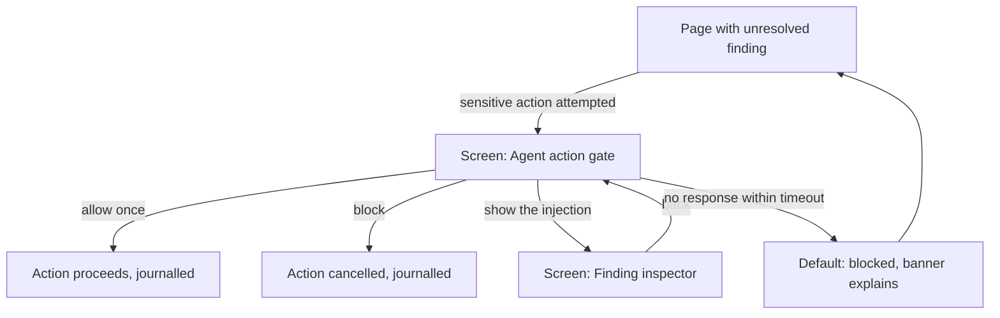
```mermaid
flowchart TD
  A[Page with unresolved finding] -->|sensitive action attempted| B[Screen: Agent action gate]
  B -->|allow once| C[Action proceeds, journalled]
  B -->|block| D[Action cancelled, journalled]
  B -->|show the injection| E[Screen: Finding inspector]
  E -->|back| B
  B -->|no response within timeout| D_to[Default: blocked, banner explains]
  D_to --> A
```

- **Screens traversed:**
  | Screen | States used here |
  |--------|------------------|
  | SCR-06 Agent action gate | success, error |
  | SCR-04 Finding inspector | success |

### FLW-04: Known-malicious page blocked
- **Traces:** ST-005, ST-016 (JTBD-02, JRN-03/#2)
- **Goal:** the page never renders; the user understands why and has an honest way past
- **Entry points:** navigation to a URL matching a signed feed entry
- **Success exit:** user leaves safely, or proceeds deliberately with the choice remembered
- **Task analysis:**
  1. Understand what was blocked and on whose authority
  2. Leave, or override deliberately
- **Flow:**

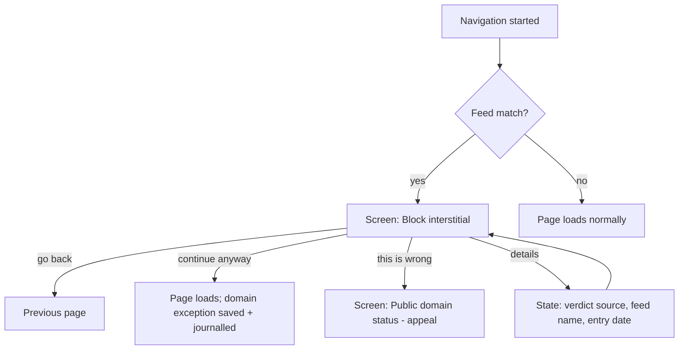
```mermaid
flowchart TD
  A[Navigation started] --> B{Feed match?}
  B -->|yes| C[Screen: Block interstitial]
  B -->|no| Z[Page loads normally]
  C -->|go back| D[Previous page]
  C -->|continue anyway| E[Page loads; domain exception saved + journalled]
  C -->|this is wrong| F[Screen: Public domain status - appeal]
  C -->|details| C2[State: verdict source, feed name, entry date]
  C2 --> C
```

- **Screens traversed:**
  | Screen | States used here |
  |--------|------------------|
  | SCR-05 Block interstitial | success, error |
  | SCR-14 Public domain status | success |

### FLW-05: Lookalike domain warning
- **Traces:** ST-006 (JTBD-02)
- **Goal:** the user sees that the domain resembles one they trust but is not it, before interacting
- **Entry points:** page load on a domain within confusable/typo distance of the watchlist or the popular-domains list
- **Success exit:** the user leaves, or marks the domain legitimate and it stops warning
- **Task analysis:**
  1. See both spellings side by side
  2. Decide: leave, or mark as legitimate
- **Flow:**

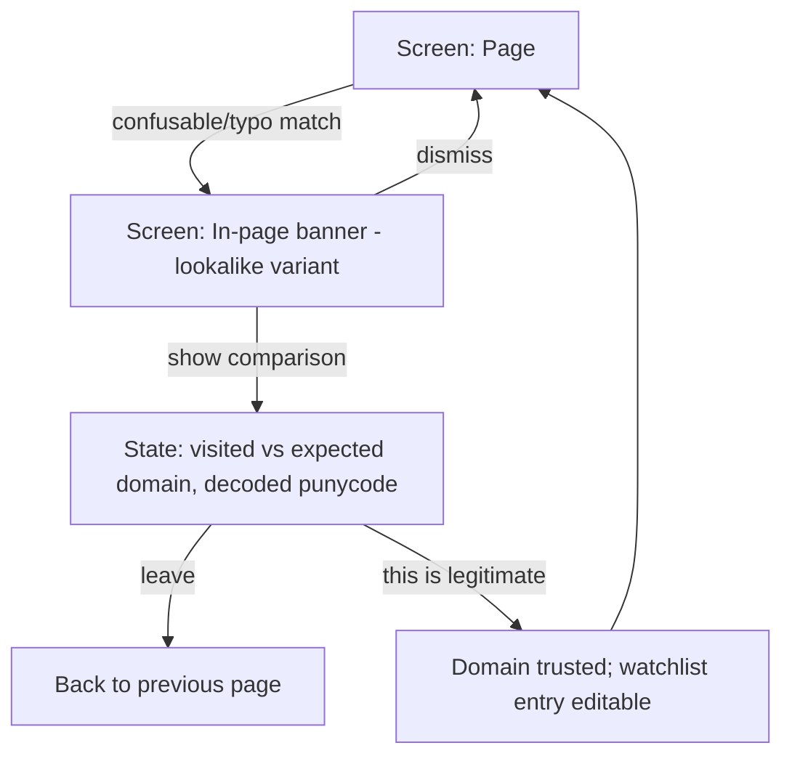
```mermaid
flowchart TD
  A[Screen: Page] -->|confusable/typo match| B[Screen: In-page banner - lookalike variant]
  B -->|show comparison| C[State: visited vs expected domain, decoded punycode]
  C -->|leave| D[Back to previous page]
  C -->|this is legitimate| E[Domain trusted; watchlist entry editable]
  E --> A
  B -->|dismiss| A
```

- **Screens traversed:**
  | Screen | States used here |
  |--------|------------------|
  | SCR-03 In-page warning banner | success |
  | SCR-12 Settings | success |
  | SCR-16 Trusted domains | success, empty |

### FLW-06: ClickFix — page copies a command
- **Traces:** ST-007 (JTBD-02, JRN-03/#3)
- **Goal:** interrupt between the clipboard write and the user pasting into a system dialog — the last moment we can reach
- **Entry points:** script-initiated clipboard write containing a shell-like payload, with no genuine user copy action
- **Success exit:** user does not run the command; clipboard content is flagged
- **Task analysis:**
  1. Stop before switching windows
  2. Understand in one sentence why this is fake
  3. Leave, or override deliberately
- **Flow:**

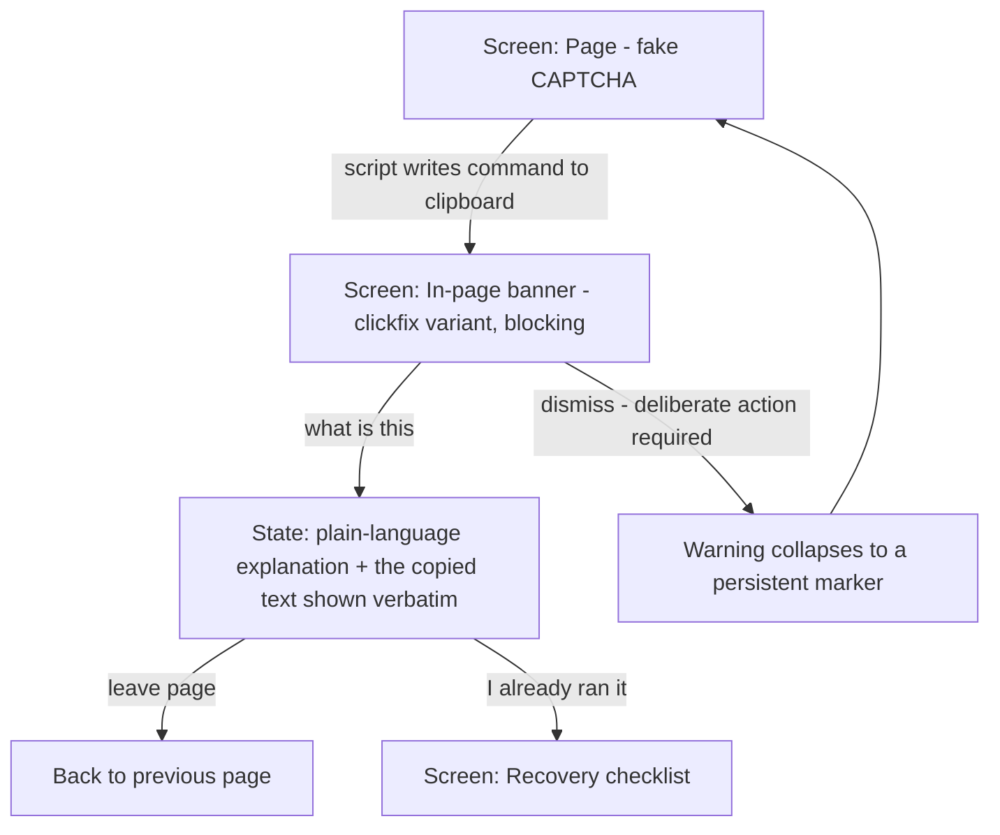
```mermaid
flowchart TD
  A[Screen: Page - fake CAPTCHA] -->|script writes command to clipboard| B[Screen: In-page banner - clickfix variant, blocking]
  B -->|what is this| C[State: plain-language explanation + the copied text shown verbatim]
  C -->|leave page| D[Back to previous page]
  C -->|I already ran it| E[Screen: Recovery checklist]
  B -->|dismiss - deliberate action required| F[Warning collapses to a persistent marker]
  F --> A
```

- **Screens traversed:**
  | Screen | States used here |
  |--------|------------------|
  | SCR-03 In-page warning banner | success |
  | SCR-13 Recovery checklist | success |

### FLW-07: Browser-lock trap escape
- **Traces:** ST-008 (JTBD-02, JTBD-06)
- **Goal:** break the trap and explain it, so the user does not call the number on screen
- **Entry points:** forced fullscreen without user gesture; looping modal dialogs; fake OS/browser chrome
- **Success exit:** the user is out of the trap and on a safe page
- **Task analysis:**
  1. Regain control of the window
  2. Understand it was fake
  3. Leave
- **Flow:**

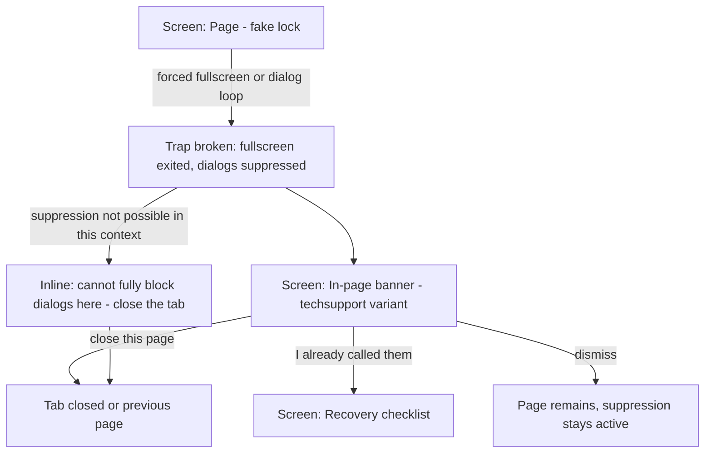
```mermaid
flowchart TD
  A[Screen: Page - fake lock] -->|forced fullscreen or dialog loop| B[Trap broken: fullscreen exited, dialogs suppressed]
  B --> C[Screen: In-page banner - techsupport variant]
  C -->|close this page| D[Tab closed or previous page]
  C -->|I already called them| E[Screen: Recovery checklist]
  C -->|dismiss| A2[Page remains, suppression stays active]
  B -->|suppression not possible in this context| B_err[Inline: cannot fully block dialogs here - close the tab]
  B_err --> D
```

- **Screens traversed:**
  | Screen | States used here |
  |--------|------------------|
  | SCR-03 In-page warning banner | success, error |
  | SCR-13 Recovery checklist | success |

### FLW-08: Download check
- **Traces:** ST-009 (JTBD-02)
- **Goal:** a dangerous file is stopped before it is saved, and the user is told exactly which checks applied
- **Entry points:** download started
- **Success exit:** file kept after a clean check, or discarded after a warning
- **Task analysis:**
  1. See the verdict before the file lands
  2. Keep or discard
- **Flow:**

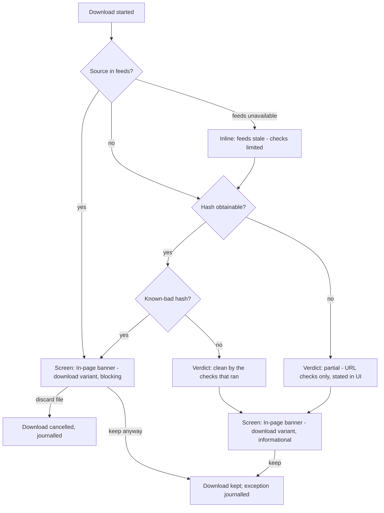
```mermaid
flowchart TD
  A[Download started] --> B{Source in feeds?}
  B -->|yes| W[Screen: In-page banner - download variant, blocking]
  B -->|no| C{Hash obtainable?}
  C -->|yes| D{Known-bad hash?}
  C -->|no| E[Verdict: partial - URL checks only, stated in UI]
  D -->|yes| W
  D -->|no| F[Verdict: clean by the checks that ran]
  E --> G[Screen: In-page banner - download variant, informational]
  F --> G
  W -->|discard file| H[Download cancelled, journalled]
  W -->|keep anyway| I[Download kept; exception journalled]
  G -->|keep| I
  B -->|feeds unavailable| B_err[Inline: feeds stale - checks limited]
  B_err --> C
```

- **Screens traversed:**
  | Screen | States used here |
  |--------|------------------|
  | SCR-03 In-page warning banner | success, error |

### FLW-09: Credential-entry guard
- **Traces:** ST-010 (JTBD-02, JRN-03/#4)
- **Goal:** the user pauses before typing a password or card into a domain that is new or unlike the brand it imitates
- **Entry points:** focus on a password or payment field on an untrusted domain
- **Success exit:** the user leaves, or proceeds having trusted the domain
- **Task analysis:**
  1. See why this domain is unusual, before typing
  2. Leave or trust
- **Flow:**

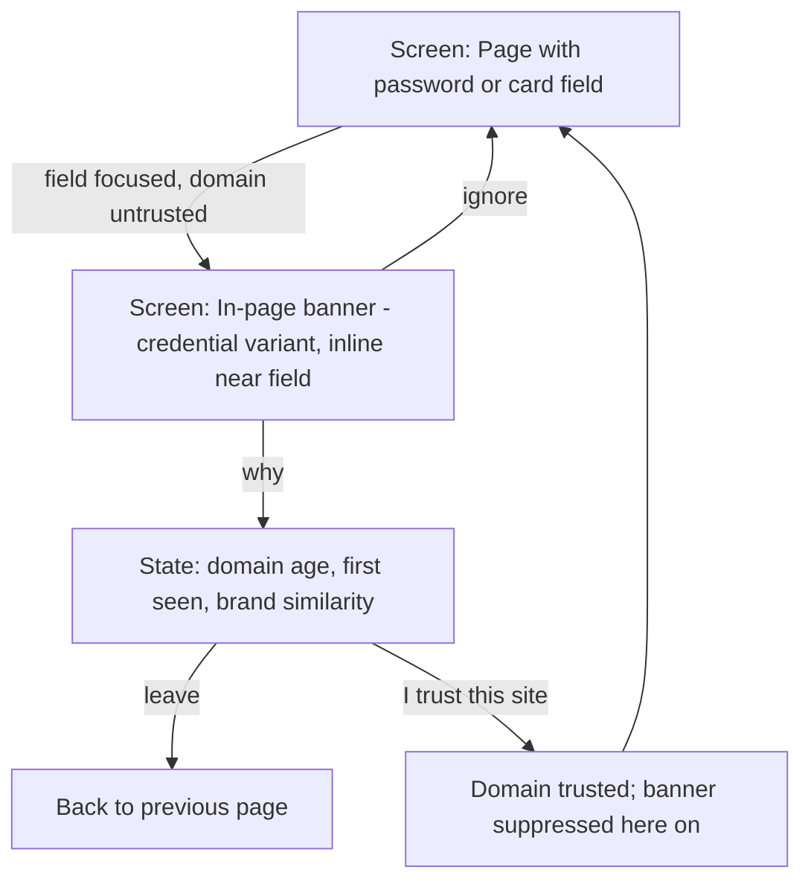
```mermaid
flowchart TD
  A[Screen: Page with password or card field] -->|field focused, domain untrusted| B[Screen: In-page banner - credential variant, inline near field]
  B -->|why| C[State: domain age, first seen, brand similarity]
  C -->|leave| D[Back to previous page]
  C -->|I trust this site| E[Domain trusted; banner suppressed here on]
  E --> A
  B -->|ignore| A
```

- **Screens traversed:**
  | Screen | States used here |
  |--------|------------------|
  | SCR-03 In-page warning banner | success |

### FLW-10: Password leak check
- **Traces:** ST-011 (JTBD-04, JTBD-05, JRN-02/#1)
- **Goal:** the user learns a password is compromised without the password leaving the device
- **Entry points:** password submitted on a form; manual check in SCR-08
- **Success exit:** verdict shown; if compromised, the repair step is one click away
- **Task analysis:**
  1. Learn the verdict at the moment it matters
  2. See what actually left the device
  3. Start the repair
- **Flow:**

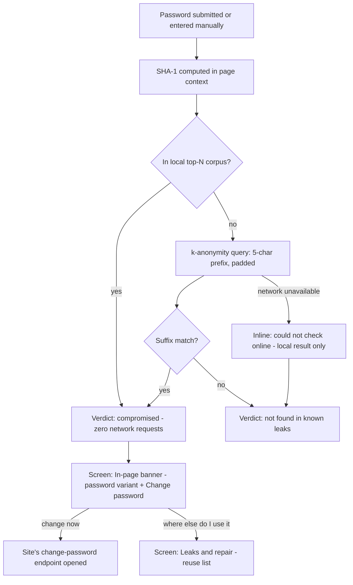
```mermaid
flowchart TD
  A[Password submitted or entered manually] --> B[SHA-1 computed in page context]
  B --> C{In local top-N corpus?}
  C -->|yes| D[Verdict: compromised - zero network requests]
  C -->|no| E[k-anonymity query: 5-char prefix, padded]
  E --> F{Suffix match?}
  F -->|yes| D
  F -->|no| G[Verdict: not found in known leaks]
  E -->|network unavailable| E_err[Inline: could not check online - local result only]
  E_err --> G
  D --> H[Screen: In-page banner - password variant + Change password]
  H -->|change now| I[Site's change-password endpoint opened]
  H -->|where else do I use it| J[Screen: Leaks and repair - reuse list]
```

- **Screens traversed:**
  | Screen | States used here |
  |--------|------------------|
  | SCR-03 In-page warning banner | success, error |
  | SCR-08 Leaks and repair | success |

### FLW-11: Leak inventory and repair
- **Traces:** ST-012, ST-015 (JTBD-04, JRN-02/#2-6)
- **Goal:** the user sees which accounts are exposed, understands each, and completes repairs
- **Entry points:** SCR-07 findings queue; SCR-02 popup; first run
- **Success exit:** each handled leak marked resolved and archived
- **Task analysis:**
  1. See what is exposed, freshest first
  2. Understand one entry
  3. Repair it
  4. Mark it done
- **Flow:**

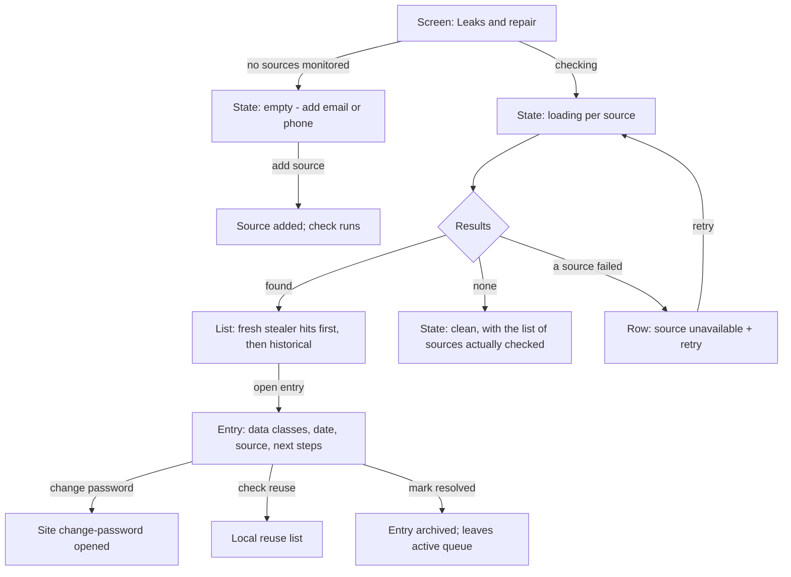
```mermaid
flowchart TD
  A[Screen: Leaks and repair] -->|no sources monitored| A_empty[State: empty - add email or phone]
  A_empty -->|add source| B[Source added; check runs]
  A -->|checking| A_load[State: loading per source]
  A_load --> C{Results}
  C -->|found| D[List: fresh stealer hits first, then historical]
  C -->|none| E[State: clean, with the list of sources actually checked]
  C -->|a source failed| C_err[Row: source unavailable + retry]
  C_err -->|retry| A_load
  D -->|open entry| F[Entry: data classes, date, source, next steps]
  F -->|change password| G[Site change-password opened]
  F -->|check reuse| H[Local reuse list]
  F -->|mark resolved| I[Entry archived; leaves active queue]
```

- **Screens traversed:**
  | Screen | States used here |
  |--------|------------------|
  | SCR-08 Leaks and repair | loading, empty, error, success |

### FLW-12: Extension change alert
- **Traces:** ST-013, ST-014 (JTBD-03)
- **Goal:** the user is told the moment an installed extension changes owner or gains permissions, and can act in one step
- **Entry points:** extension update detected; scheduled inventory snapshot; manual open of SCR-09
- **Success exit:** the delta is disabled, trusted, or acknowledged — never left silently pending
- **Task analysis:**
  1. See exactly what changed
  2. Judge the risk
  3. Disable or trust
- **Flow:**

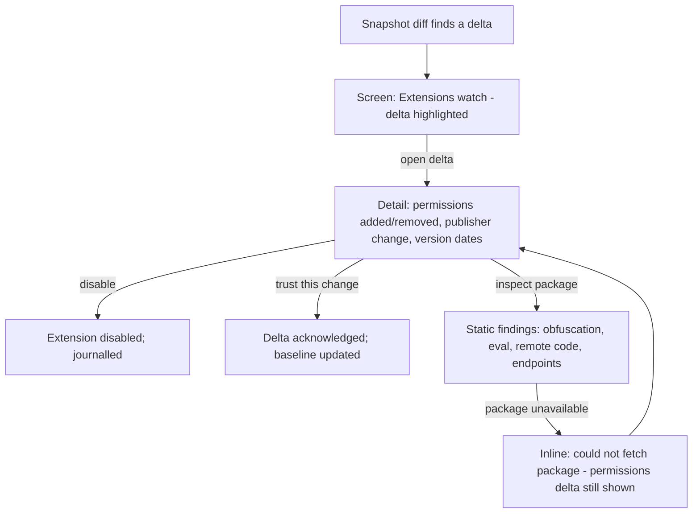
```mermaid
flowchart TD
  A[Snapshot diff finds a delta] --> B[Screen: Extensions watch - delta highlighted]
  B -->|open delta| C[Detail: permissions added/removed, publisher change, version dates]
  C -->|disable| D[Extension disabled; journalled]
  C -->|trust this change| E[Delta acknowledged; baseline updated]
  C -->|inspect package| F[Static findings: obfuscation, eval, remote code, endpoints]
  F -->|package unavailable| F_err[Inline: could not fetch package - permissions delta still shown]
  F_err --> C
```

- **Screens traversed:**
  | Screen | States used here |
  |--------|------------------|
  | SCR-09 Extensions watch | loading, empty, error, success |

### FLW-13: Verify what left the device
- **Traces:** ST-017 (JTBD-05, JRN-01/#7)
- **Goal:** the user can answer "what did this send?" from the UI, and check it against a real network trace
- **Entry points:** SCR-02 popup footer; SCR-12 settings; any finding's "what was sent" link
- **Success exit:** the user has seen, filtered, and optionally exported the outbound log
- **Task analysis:**
  1. See every outbound request with purpose and payload shape
  2. Filter to a period or a feature
  3. Export to compare with a network trace
- **Flow:**

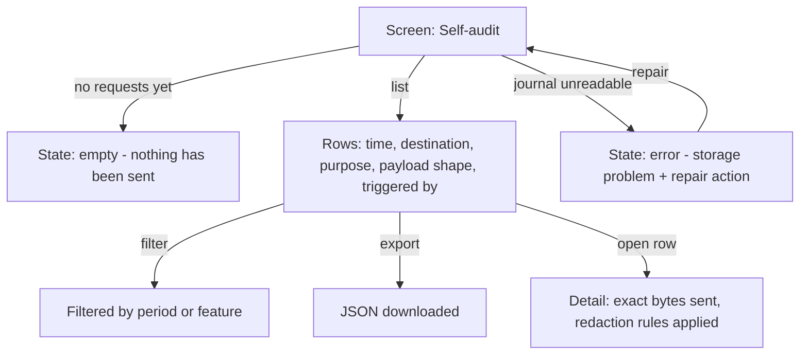
```mermaid
flowchart TD
  A[Screen: Self-audit] -->|no requests yet| A_empty[State: empty - nothing has been sent]
  A -->|list| B[Rows: time, destination, purpose, payload shape, triggered by]
  B -->|filter| C[Filtered by period or feature]
  B -->|export| D[JSON downloaded]
  B -->|open row| E[Detail: exact bytes sent, redaction rules applied]
  A -->|journal unreadable| A_err[State: error - storage problem + repair action]
  A_err -->|repair| A
```

- **Screens traversed:**
  | Screen | States used here |
  |--------|------------------|
  | SCR-10 Self-audit | loading, empty, error, success |

### FLW-14: Own the data — export or wipe
- **Traces:** ST-019 (JTBD-05)
- **Goal:** leaving the product costs one click and no residue
- **Entry points:** SCR-12 settings
- **Success exit:** data exported, or wiped after one confirmation
- **Task analysis:**
  1. Choose export or wipe
  2. Confirm destructive action
- **Flow:**

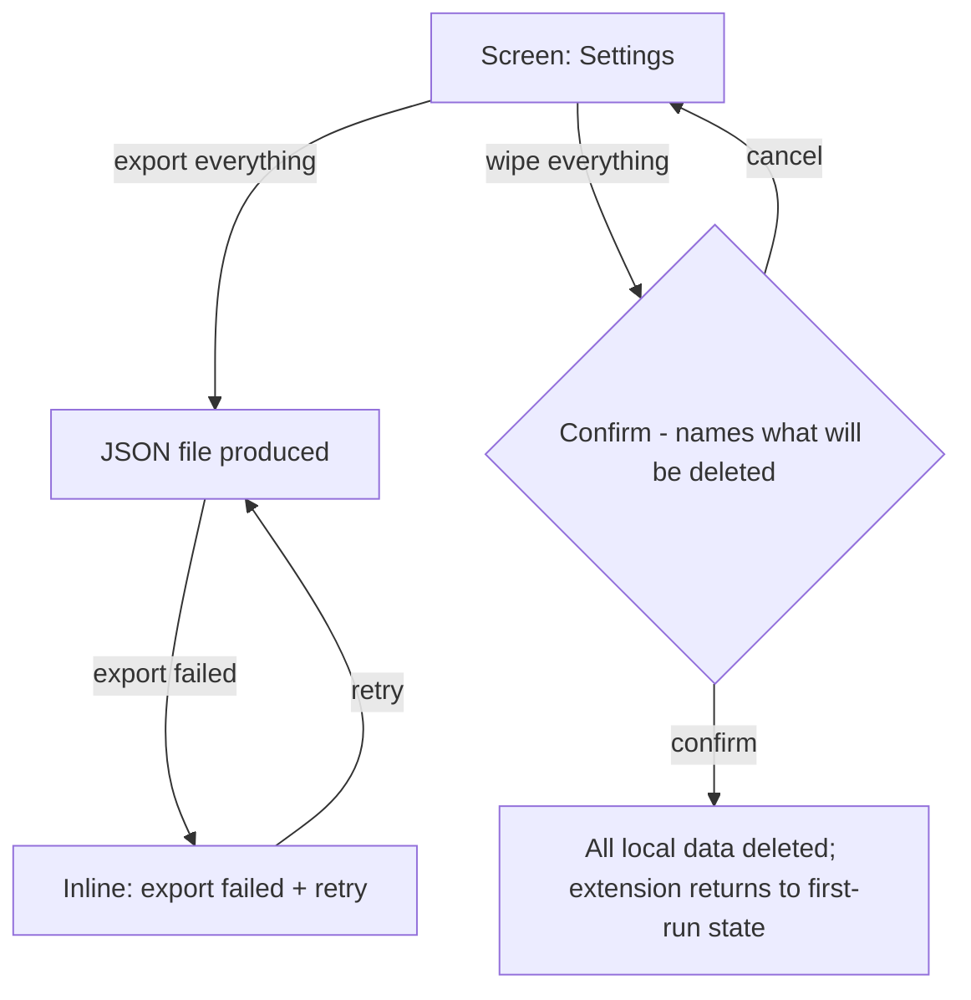
```mermaid
flowchart TD
  A[Screen: Settings] -->|export everything| B[JSON file produced]
  A -->|wipe everything| C{Confirm - names what will be deleted}
  C -->|confirm| D[All local data deleted; extension returns to first-run state]
  C -->|cancel| A
  B -->|export failed| B_err[Inline: export failed + retry]
  B_err -->|retry| B
```

- **Screens traversed:**
  | Screen | States used here |
  |--------|------------------|
  | SCR-12 Settings | success, error |
  | SCR-16 Trusted domains | success, empty |
  | SCR-01 First-run check | success |

### FLW-15: Site owner checks and appeals a verdict
- **Traces:** ST-016 (JTBD-08)
- **Goal:** an owner sees their domain's status and opens an appeal without an account
- **Entry points:** link on SCR-05 interstitial; public URL shared by a customer
- **Success exit:** the owner has the verdict, its source, and a submitted appeal
- **Task analysis:**
  1. Look up the domain
  2. See the verdict and which feed produced it
  3. Appeal or go to the upstream source
- **Flow:**

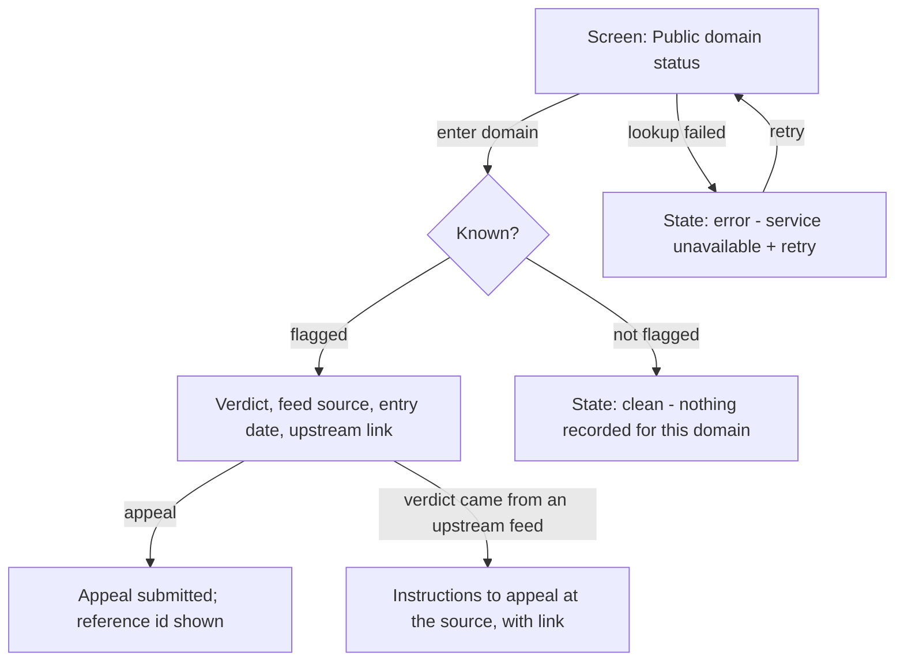
```mermaid
flowchart TD
  A[Screen: Public domain status] -->|enter domain| B{Known?}
  B -->|flagged| C[Verdict, feed source, entry date, upstream link]
  B -->|not flagged| D[State: clean - nothing recorded for this domain]
  C -->|appeal| E[Appeal submitted; reference id shown]
  C -->|verdict came from an upstream feed| F[Instructions to appeal at the source, with link]
  A -->|lookup failed| A_err[State: error - service unavailable + retry]
  A_err -->|retry| A
```

- **Screens traversed:**
  | Screen | States used here |
  |--------|------------------|
  | SCR-14 Public domain status | loading, empty, error, success |

### FLW-16: Recovery — "I already fell for it"
- **Traces:** ST-015 (JTBD-06, JRN-03/#5)
- **Goal:** turn panic into an ordered checklist matched to what actually happened
- **Entry points:** "I already ran it / already entered it" from any banner; SCR-02 popup; SCR-07 queue
- **Success exit:** the checklist for that incident type is completed or explicitly deferred
- **Task analysis:**
  1. Say what happened
  2. Work an ordered list, most damaging first
  3. Mark the incident handled
- **Flow:**

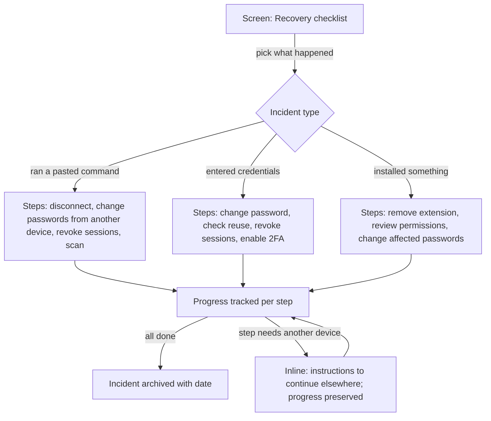
```mermaid
flowchart TD
  A[Screen: Recovery checklist] -->|pick what happened| B{Incident type}
  B -->|ran a pasted command| C[Steps: disconnect, change passwords from another device, revoke sessions, scan]
  B -->|entered credentials| D[Steps: change password, check reuse, revoke sessions, enable 2FA]
  B -->|installed something| E[Steps: remove extension, review permissions, change affected passwords]
  C --> F[Progress tracked per step]
  D --> F
  E --> F
  F -->|all done| G[Incident archived with date]
  F -->|step needs another device| H[Inline: instructions to continue elsewhere; progress preserved]
  H --> F
```

- **Screens traversed:**
  | Screen | States used here |
  |--------|------------------|
  | SCR-13 Recovery checklist | loading, empty, success |
  | SCR-08 Leaks and repair | success |

### FLW-17: Daily check-in — popup, overview, and what changed
- **Traces:** ST-015, ST-017 (JTBD-02, JTBD-05, JRN-02/#6)
- **Goal:** the returning user sees the state of the current page and what needs
  them across every area, without a wall of old alerts and without scrolling to
  find out
- **Entry points:** toolbar icon (popup); badge on a new finding; the
  extension's own page opened directly (lands on the overview); **a deep link
  from the popup or from a banner, which opens its area directly** —
  `options.html#queue`, `#journal`, `#leaks`, `#extensions`, `#trusted`,
  `#audit`, `#data`, `#recovery=<kind>`
- **Success exit:** the user knows the current page's verdict, and has either
  acted on the top item or seen that nothing needs them — with the count of what
  does still visible on the way back
- **Task analysis:**
  1. See this page's verdict and today's count (popup)
  2. Either act on the top item in place, or open the area that owns it
  3. Coming to the page with no destination in mind: see what needs attention
     across all areas, ranked, and pick one
  4. Act there, then return — the return says how much is left
- **Flow:**

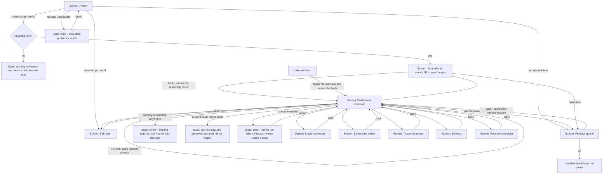
```mermaid
flowchart TD
  A[Screen: Popup] -->|current page verdict| B{Anything new?}
  B -->|no| C[State: nothing new since last check + last-checked time]
  B -->|yes| D[Screen: Journal and weekly diff - only changes]
  A -->|what did you send| G[Screen: Self-audit]
  A -->|top queued item| E[Screen: Findings queue]
  A -->|storage unreadable| A_err[State: error - local data problem + repair]
  A_err -->|repair| A

  O[Screen: Dashboard overview] -->|no hash: page opened directly| O
  O -->|nothing outstanding anywhere| O_empty[State: empty - nothing requires you + when last checked]
  O -->|a count could not be read| O_part[State: that row says the state was not read, never 'empty']
  O -->|store unreadable| O_err[State: error - names the failure + repair; no row claims a state]
  O_err -->|repair| O

  O -->|attention row or area row| E
  O --> D
  O --> L[Screen: Leaks and repair]
  O --> X[Screen: Extensions watch]
  O --> T[Screen: Trusted domains]
  O --> G
  O --> S[Screen: Settings]
  O --> R[Screen: Recovery checklist]

  D -->|back - carries the remaining count| O
  E -->|act| F[Handled item leaves the queue]
  E -->|back - carries the remaining count| O
  L -->|back| O
  X -->|back| O
  T -->|back| O
  G -->|back| O
  S -->|back| O
  R -->|back| O

  D -->|open item| E
  U[Unknown hash] -->|opens the overview and names the hash| O
```

- **Screens traversed:**
  | Screen | States used here |
  |--------|------------------|
  | SCR-02 Popup | loading, empty, error, success |
  | SCR-15 Dashboard overview | loading, empty, error, success |
  | SCR-11 Journal and weekly diff | empty, success |
  | SCR-07 Findings queue | success |
  | SCR-10 Self-audit | success |

- **What changed here, 2026-08-12.** The diagram above already drew the journal,
  the queue and the self-audit as separate screens with transitions between
  them; the implementation stacked all eight areas on one page and made the
  transitions scroll positions — of which exactly one was wired
  (`SECTION_FOR_HASH` held `#queue`, while the popup produced `#journal` from
  two call sites). So the deep-link edges and the overview node are not a new
  design; they are this flow, finally built. The redesign, its findings and the
  losing alternative are in
  [plans/2026-08-12-options-dashboard.md](plans/2026-08-12-options-dashboard.md).
